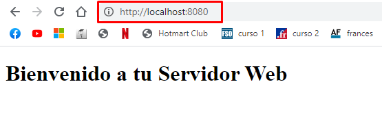
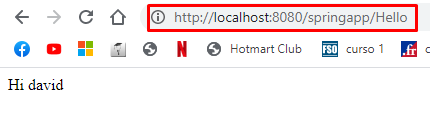
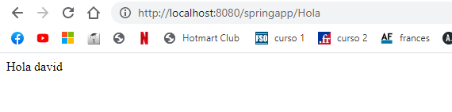
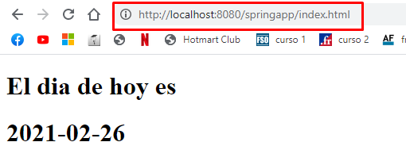

## AREP-2021 LAB-4

Este proyecto cuenta de una aplicacion web que esta sirviendo por medio de pojos, la idea principal del 'proyecto es poder desarrollar una
especie de Spring pero propio en este caso llamado MiniSpring, se utilizan anotaciones para que responda y redireccione a las solicitudes
que el usuario le haga. Ademas esta aplicacion se despliega en Heroku y se integra con CircleCi

### Prerequisitos

- Maven: Esta es la herramienta encargada de la creacion del proyecto y ayuda a manejar la despedencias del mismo
- Git: Software de control de versiones.
- JDK: Es la herramienta que sirve para desarrollar en java, versiones de este programa desde la 8 en adelante.
- Heroku: Debe tener instalado heroku cli en su computador si desea correr la aplicacion de manera local

### Instalacion

 Para poder instalar el programa debe clonar este repositorio en su computador, esto lo puede hacer con el sigueinte comando.
 >https://github.com/DavidAndresHerrera/AREP-LAB4.git

 antes de clonar el proyecto en su maquina local verifique la ubicacion donde quiere dejar el proyecto.
 
### Ejecucion y empaquetado

Para empaquetar y ejecutar el programa usando maven ingresa el siguiente comando dentro de la carpeta Media_DsvEstandar-app
> mvn package

Cuando ya el proyecto ha compilado, puede proceder a ejecutarlo, use el siguiente comando sobre el directorio SparkWebApp

> java -cp "target/classes" edu.escuelaing.arep.miniSpring.MiniSpringBoot edu.escuelaing.arep.demo.HelloController

### Ejecucion de pruebas

Despues de empaquetado el programa y saber que esta corriendo de manera correcta ingresa el sigueitne comando
> mvn test

### Despliegue

Al ingresar a la pagina, la pagina principal se debe ver asi :

Lo primero que va a ver es la pagina inicial 

Despues se pone la anotacion para que salga lo que tiene la anotacion 

### Integracion continua

En este link puede encontrar la integracion continua en CircleCi

### Licencia
GNU General Public License v3.0 

### Autor 

#### David Andres Herrera Moya 
